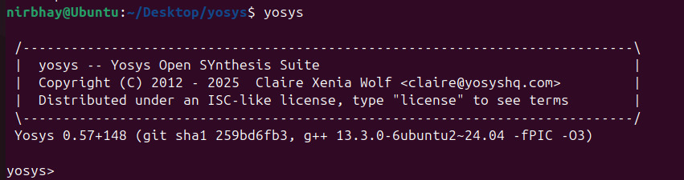
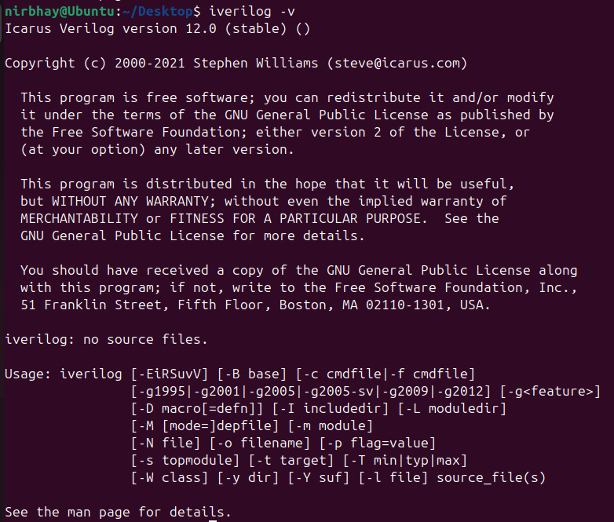
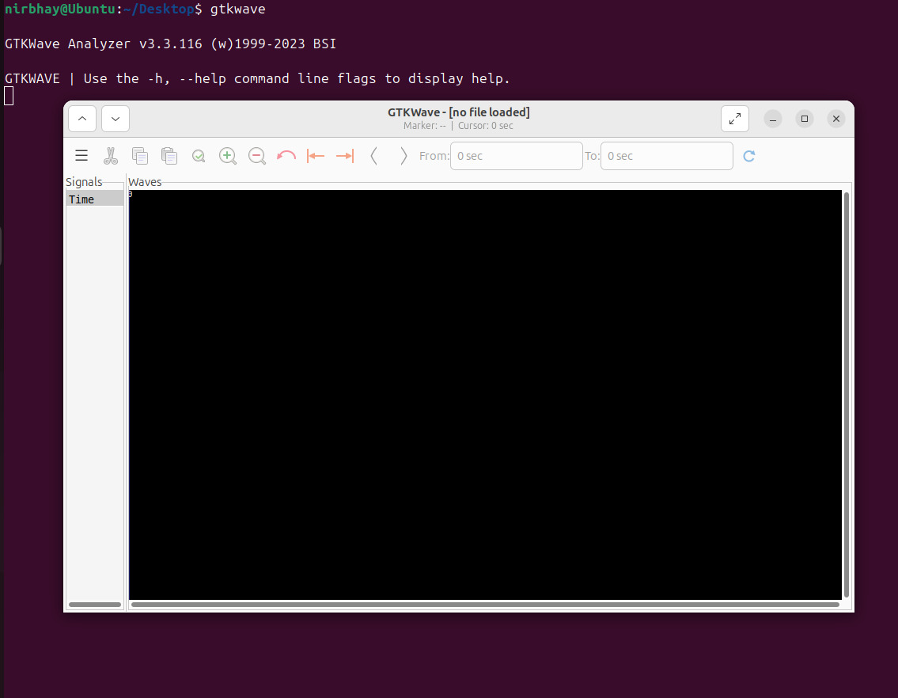

# 🛠️ Week 0 — Tool Installation | RISC-V SoC Tapeout (VSD)

Welcome to **Week 0** of the **RISC-V Reference SoC Tapeout Program (VSD)**.  
This week focused on **setting up the environment** and installing the essential open-source EDA tools.

---

## ⚙️ System Requirements

| Resource | Requirement |
|----------|-------------|
| RAM      | 6 GB |
| Storage  | 50 GB HDD |
| OS       | Ubuntu 24.04.3 |
| CPU      | 4 vCPU |

---

### **TOOL CHECK**

#### <ins>**Yosys**</ins>
```bash
$ sudo apt-get update
$sudo apt install git                 #If git is not installed
$ git clone https://github.com/YosysHQ/yosys.git
$ cd yosys
$ git submodule update --init --recursive
$ sudo apt install make               # If make is not installed
$ sudo apt-get install build-essential clang bison flex \
    libreadline-dev gawk tcl-dev libffi-dev git \
    graphviz xdot pkg-config python3 libboost-system-dev \
    libboost-python-dev libboost-filesystem-dev zlib1g-dev
$ make config-gcc
$ make 
$ sudo make install
```


#### <ins>**Iverilog**</ins>
```bash
$ sudo apt-get update
$ sudo apt-get install iverilog
```


#### <ins>**gtkwave**</ins>
```bash
$ sudo apt-get update
$ sudo apt install gtkwave
```

