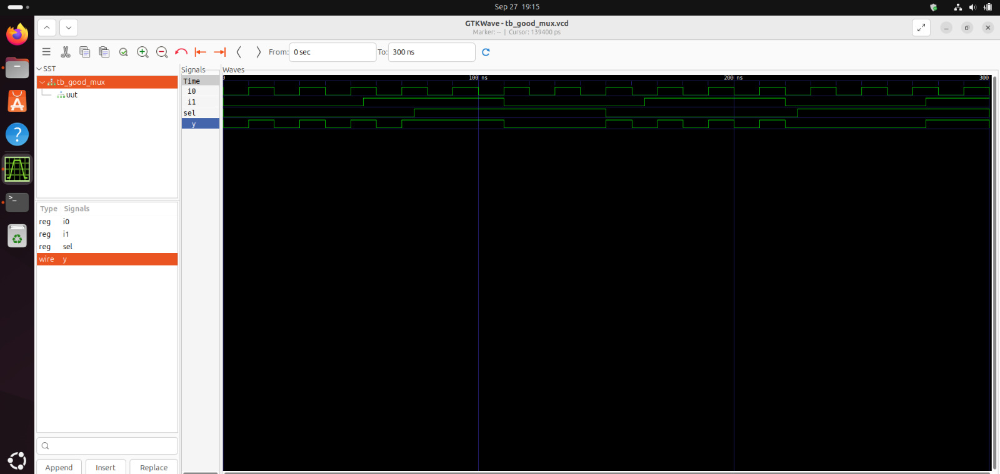
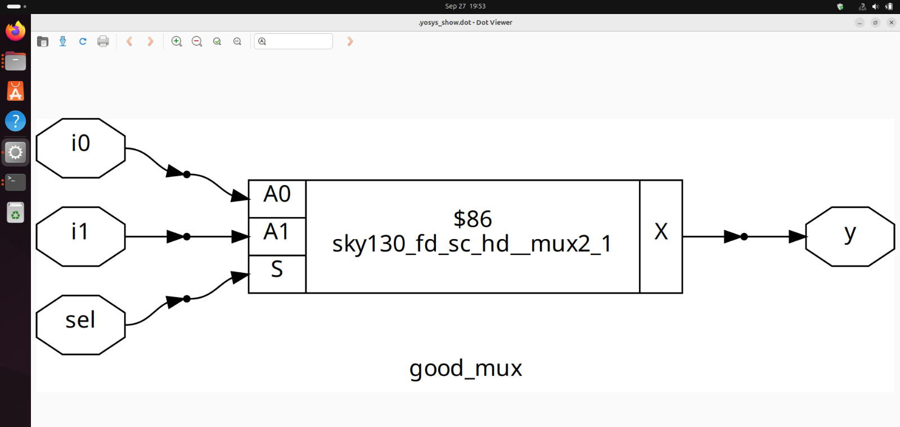
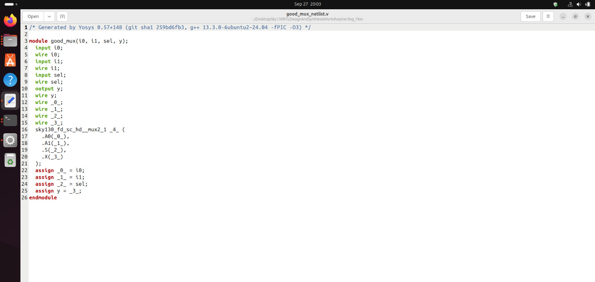

# 📘 Week 1 — Day 1: RTL Design & Logic Synthesis

## 🔹 Topics Covered

### 1. Icarus Verilog (Iverilog) & GTKWave — RTL Design & Simulation
- **Purpose**: Verify RTL design functionality against the specification.  
- **Design (RTL)**: Verilog code that implements the required functionality.  
- **Testbench (TB)**:  
  - Provides stimulus to the design.  
  - Has **no primary inputs/outputs** (only the RTL design has them).  
- **Simulator workflow**:
  1. Iverilog compiles and simulates the **Design + Testbench**.  
  2. Simulation generates a `.vcd` (Value Change Dump) file.  
  3. **GTKWave** reads the `.vcd` file to visualize waveforms.  
- **Flow**:  
  `Design + Testbench → Iverilog → .vcd file → GTKWave (waveform visualization)`

#### 🧪 Practical Lab Steps
```bash
# Clone the workshop repository
$ git clone https://github.com/kunalg123/sky130RTLDesignAndSynthesisWorkshop.git

# Navigate to Verilog files
$ cd sky130RTLDesignAndSynthesisWorkshop/verilog_files

# Compile design and testbench using Iverilog
$ iverilog good_mux.v tb_good_mux.v

# Run the simulation (produces VCD file)
$ ./a.out

# Open waveform in GTKWave
$ gtkwave tb_good_mux.vcd
```

---

### 2. Yosys & Logic Synthesis
- **Role of synthesizer**: Converts **RTL** into **gate-level netlist**.  
- **Netlist**: Hardware circuit described using logic gates and connections.  
- **Verification after synthesis**:
  - Netlist + Same Testbench → Iverilog → `.vcd` → GTKWave.  
  - Output waveforms must **match RTL simulation results**.

### 🧩 Yosys Synthesis  

```bash
yosys
read_liberty -lib ../lib/sky130_fd_sc_hd__tt_025C_1v80.lib
read_verilog good_mux.v
synth -top good_mux
abc -liberty ../lib/sky130_fd_sc_hd__tt_025C_1v80.lib
show
```


---

### 3. Logic Synthesis Overview
- **RTL Design**: High-level behavioral description of the circuit in HDL.  
- **Synthesis**: Maps RTL to logic gates and connections.  
- **Output**: **Netlist file** (actual hardware representation).  

### Export Netlist  

```bash
write_verilog -noattr good_mux_netlist.v 
!gedit good_mux_flat.v
```


---

## ✅ Key Learnings
- Understood **how Iverilog simulates RTL designs**.  
- Learned **role of Testbench** (stimulus without primary I/O).  
- Used **GTKWave to visualize simulation results** from `.vcd` files.  
- Explored **Yosys for synthesis** and verified netlist correctness.  
- Gained insight into **RTL → Netlist → Simulation flow**.  
