## 📅 Week 1 — Day 2  

### 🏷️ Understanding Technology Library Naming (Example: `tt_025C_1v80`)  

When working with the SkyWater 130nm PDK, we often see libraries named like:  

`sky130_fd_sc_hd__tt_025C_1v80.lib`  

Here’s what each part means:  

- **tt** → *Typical-Typical* process corner  
  - Represents average values of transistor parameters during fabrication.  
  - Other corners include `ss` (slow-slow), `ff` (fast-fast), etc.  

- **025C** → Temperature = **25°C**  
  - Timing and power are characterized at this operating temperature.  

- **1v80** → Voltage = **1.80 V** supply  
  - Characterization is done at this supply voltage.  

So this `.lib` file provides **timing, power, and area data** for the Sky130 130nm standard cells at the **typical process corner, 25°C, and 1.8V supply voltage**.  

### 📂 Opening the Technology Library  

To explore the contents of the library file, open it in an editor:  

```bash
gedit sky130_fd_sc_hd__tt_025C_1v80.lib
```
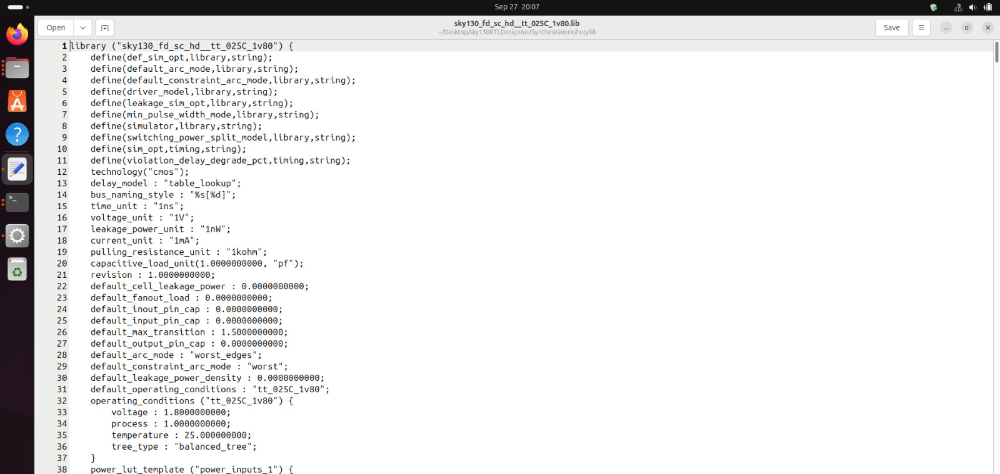

---

### 🏗️ Standard Cell Library (.lib)  

- A `.lib` file is a **collection of logical modules (standard cells)**.  
- Each logic gate (NAND, NOR, INV, etc.) is available in **different flavors** (slow, medium, fast).  

#### Why different flavors of the same gate?  
- The **combinational delay** in a logic path determines the maximum operating speed of a digital logic circuit.  
- To optimize performance, synthesis tools can choose from different flavors of the same gate:  
  - **Fast cells** → Wide transistors, higher current drive, faster charging of capacitance → Less delay → More area + More power.  
  - **Slow cells** → Narrow transistors, lower current drive → Higher delay → Less area + Less power.  

This leads to the **area, power, and timing trade-off**, which forms the foundation of design **constraints**.  

---

### ⚡ Timing in .lib  

- `.lib` also contains **PVT (Process, Voltage, Temperature) corners**:  
  - **P (Process):** Variations due to fabrication process.  
  - **V (Voltage):** Variations due to supply voltage.  
  - **T (Temperature):** Variations due to temperature changes.  

Designs must work reliably across all these corners, ensuring robustness.  

---

### 🔧 Synthesizer Workflow  

- **Top module** → Defines the highest-level design entity.  
- Synthesizer:  
  1. Matches the **ports of the top module**.  
  2. Converts RTL code (behavioral representation) into **standard cell gates** from `.lib`.  
  3. Produces a **netlist** ready for simulation and further analysis.  

---

### 🧩 Hierarchical vs Flat Synthesis  

- **Hierarchical synthesis**  
  - *Divide and conquer* approach.  
  - Useful when multiple instances of the same module are required.  
  - Easier to debug, modular.  

#### 🧩 Yosys Synthesis — Hierarchical Design  

```bash
yosys
read_liberty -lib ../lib/sky130_fd_sc_hd__tt_025C_1v80.lib
read_verilog multiple_modules.v
synth -top multiple_modules
abc -liberty ../lib/sky130_fd_sc_hd__tt_025C_1v80.lib
show
```
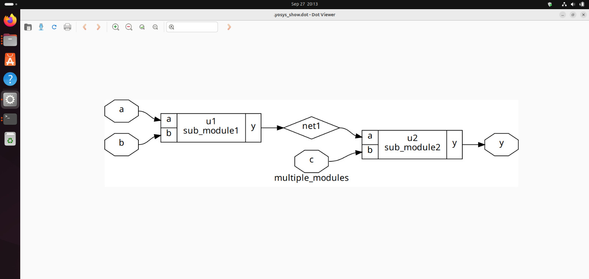

- **Flat synthesis**  
  - Flattens the hierarchy into a single level.  
  - Optimizations can be better across module boundaries.  
  - Larger designs may take longer to synthesize.  

#### 🧩 Yosys Synthesis — Hierarchical Design  

```bash
yosys
read_liberty -lib ../lib/sky130_fd_sc_hd__tt_025C_1v80.lib
read_verilog multiple_modules.v
synth -top multiple_modules
abc -liberty ../lib/sky130_fd_sc_hd__tt_025C_1v80.lib
flatten
show
```
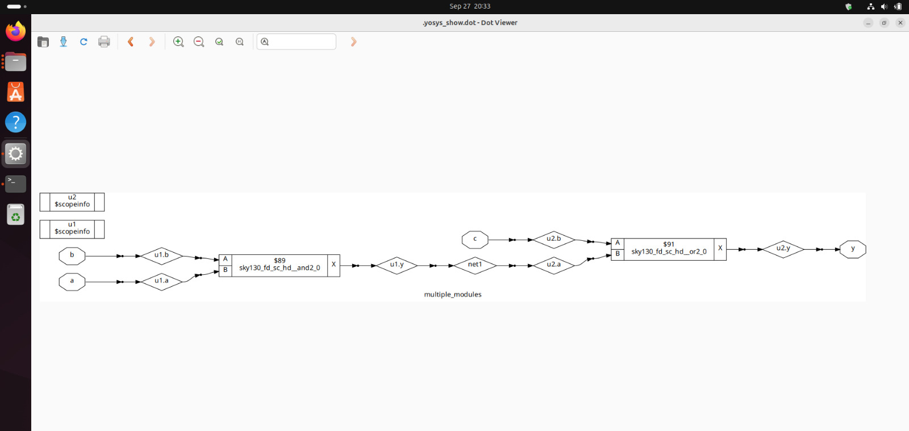

### ⏱️ Flip-Flop Based Coding Styles  

#### Why Flip-Flops are Important
- **Propagation delay** in combinational circuits can cause **glitches**.  
- If multiple combinational stages are cascaded, glitches propagate continuously.  
- **Solution:** Insert flip-flops between stages to synchronize and stabilize outputs.  
- Flip-flops can be **initialized** using Set/Reset signals:  
  - Can be **synchronous** or **asynchronous** depending on the design.  
- Flip-flops respond to **posedge** or **negedge** of the clock.  

---

### 🧩 Example Flip-Flops in Verilog  

#### 1. Asynchronous Reset D Flip-Flop
```verilog
module dff_asyncres (
    input clk,
    input async_reset,
    input d,
    output reg q
);
  always @ (posedge clk, posedge async_reset)
    if (async_reset)
      q <= 1'b0;
    else
      q <= d;
endmodule
```
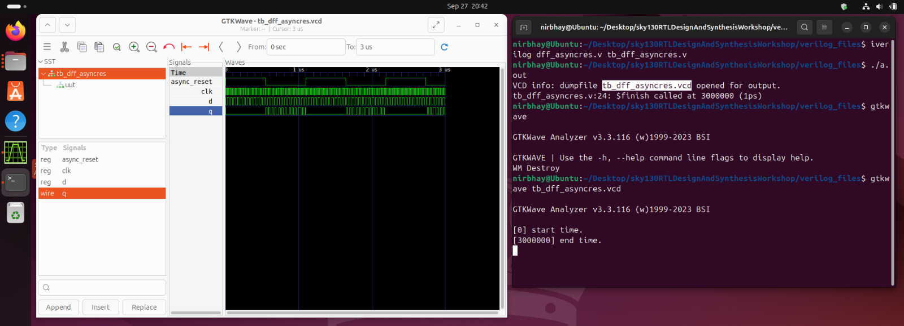
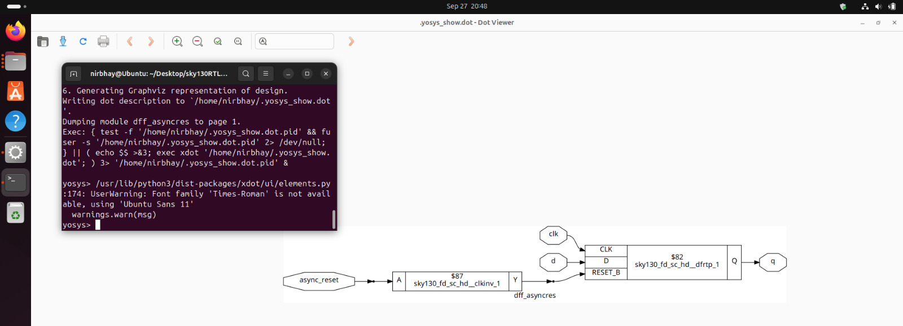

#### 2. Asynchronous Set D Flip-Flop
```verilog
module dff_async_set (
    input clk,
    input async_set,
    input d,
    output reg q
);
  always @ (posedge clk, posedge async_set)
    if (async_set)
      q <= 1'b1;
    else
      q <= d;
endmodule
```
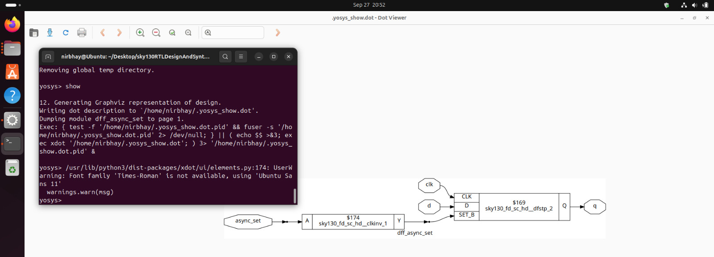

#### 2. Synchronous Reset D Flip-Flop
```verilog
module dff_syncres (
    input clk,
    input async_reset,
    input sync_reset,
    input d,
    output reg q
);
  always @ (posedge clk)
    if (sync_reset)
      q <= 1'b0;
    else
      q <= d;
endmodule
```
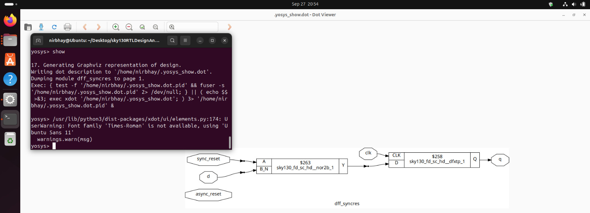

---

### 🔹 What is Optimization?
Optimization in digital design refers to reducing the **area, power, and delay** of the synthesized circuit without changing its functionality.  
Yosys performs multiple optimization passes that:
- Remove redundant logic.
- Minimize gate usage.
- Simplify Boolean expressions.
- Merge equivalent signals.
- Constant-propagate values where possible.

#### Using the same commands as above we run two files in Yosys and the following are the results of them:

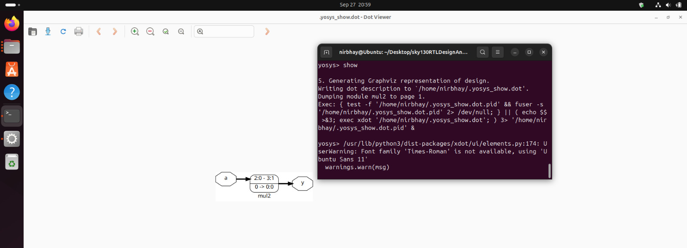
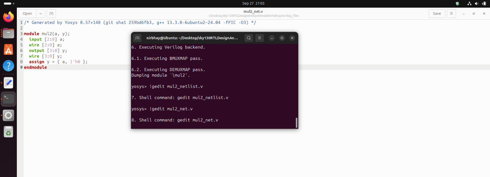
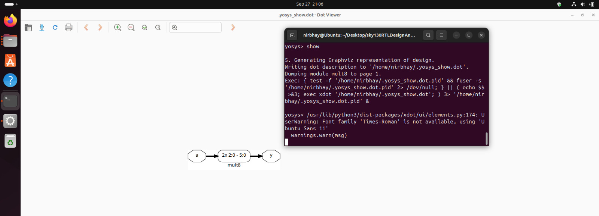
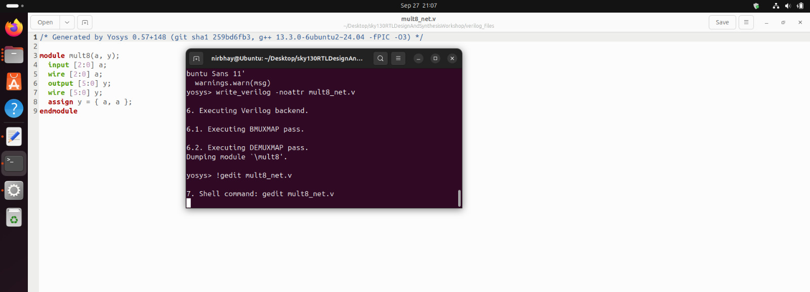
