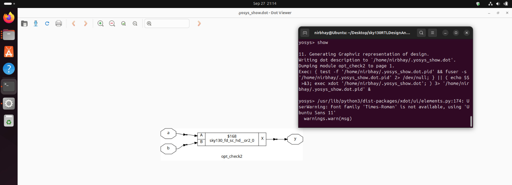

## 📅 Week 1 — Day 3: Logic Synthesis Optimizations  

Optimizations in digital design aim to **improve performance, reduce area, and save power** without changing the intended functionality of the circuit.  

---

### ⚡ 1️⃣ Combinational Logic Optimizations  

Combinational logic forms the core of digital circuits. Optimizing it ensures faster and smaller designs. Common techniques include:  

- **Constant Propagation**  
  - Identify signals that always carry a constant value (0 or 1).  
  - Replace computations using these constants with direct values.  
  - Reduces unnecessary logic and simplifies the circuit.  

- **Boolean Logic Optimization**  
  - Apply Boolean algebra techniques to simplify logic expressions.  
  - Examples: Karnaugh Maps (K-maps), Quine-McCluskey algorithm.  
  - Goal: Reduce the number of gates, minimize area, and reduce power consumption.  

#### 🖥️ Combinational Logic Lab  

Here, we apply combinational logic optimization techniques on an actual design to observe **area and power improvements**.  

##### Verilog Code for Lab 1:
```verilog
module opt_check (input a , input b , output y);
	assign y = a?b:0;
endmodule
```
Follow same steps for Yosys output and netlist as shown in Day1, just add the following line between `synth -top` and `abc -liberty`:
```bash
opt_clean -purge
```


##### Verilog Code for Lab 2:
```verilog
module opt_check2 (input a , input b , output y);
	assign y = a?1:b;
endmodule
```
Follow same steps for Yosys output and netlist as shown in Day1, just add the following line between `synth -top` and `abc -liberty`:
```bash
opt_clean -purge
```


##### Verilog Code for Lab 3:
```verilog
module opt_check3 (input a , input b, input c , output y);
	assign y = a?(c?b:0):0;
endmodule
```
Follow same steps for Yosys output and netlist as shown in Day1, just add the following line between `synth -top` and `abc -liberty`:
```bash
opt_clean -purge
```


##### Verilog Code for Lab 4:
```verilog
module opt_check4 (input a , input b , input c , output y);
 assign y = a?(b?(a & c ):c):(!c);
 endmodule
```
Follow same steps for Yosys output and netlist as shown in Day1, just add the following line between `synth -top` and `abc -liberty`:
```bash
opt_clean -purge
```


##### Verilog Code for Lab 5:
```verilog
module sub_module1(input a , input b , output y);
 assign y = a & b;
endmodule
module sub_module2(input a , input b , output y);
 assign y = a^b;
endmodule
module multiple_module_opt(input a , input b , input c , input d , output y);
wire n1,n2,n3;
sub_module1 U1 (.a(a) , .b(1'b1) , .y(n1));
sub_module2 U2 (.a(n1), .b(1'b0) , .y(n2));
sub_module2 U3 (.a(b), .b(d) , .y(n3));
assign y = c | (b & n1); 
endmodule
```
Follow same steps for Yosys output and netlist as shown in Day1, just add the following line between `synth -top` and `abc -liberty`:
```bash
opt_clean -purge
```


---

### ⚡ 2️⃣ Sequential Logic Optimizations  

Sequential logic includes flip-flops, registers, and memory elements. Optimizations can further enhance performance and reduce resource usage:  

- **Sequential Constant Propagation**  
  - Identify flip-flop outputs (`Q` pins) that always carry a constant value.  
  - Replace them with constants to eliminate redundant logic.  

- **State Optimization**  
  - Remove unused or unreachable states in finite state machines (FSMs).  
  - Reduces the number of required flip-flops and combinational logic.  

- **Retiming**  
  - Reposition flip-flops across combinational logic boundaries.  
  - Helps reduce critical path delay and allows higher clock frequency.  

- **Sequential Logic Cloning (Floorplan-Aware Synthesis)**  
  - Duplicate sequential logic to balance load or meet timing constraints.  
  - Optimized placement reduces congestion and improves timing closure.  

##### Verilog Code for Lab 1:
```verilog
module dff_const1(input clk, input reset, output reg q);
always @(posedge clk, posedge reset)
begin
	if(reset)
		q <= 1'b0;
	else
		q <= 1'b1;
end
endmodule
```
Follow same steps for Yosys output and netlist as shown in Day1, just add the following line between `synth -top` and `abc -liberty`:
```bash
opt_clean -purge
```


##### Verilog Code for Lab 2:
```verilog
module dff_const2(input clk, input reset, output reg q);
always @(posedge clk, posedge reset)
begin
	if(reset)
		q <= 1'b1;
	else
		q <= 1'b1;
end
endmodule
```
Follow same steps for Yosys output and netlist as shown in Day1, just add the following line between `synth -top` and `abc -liberty`:
```bash
opt_clean -purge
```


##### Verilog Code for Lab 3:
```verilog
module dff_const3(input clk, input reset, output reg q);
reg q1;
always @(posedge clk, posedge reset)
begin
	if(reset)
	begin
		q <= 1'b1;
		q1 <= 1'b0;
	end
	else
	begin
		q1 <= 1'b1;
		q <= q1;
	end
end
endmodule
```
Follow same steps for Yosys output and netlist as shown in Day1, just add the following line between `synth -top` and `abc -liberty`:
```bash
opt_clean -purge
```


##### Verilog Code for Lab 4:
```verilog
module dff_const4(input clk, input reset, output reg q);
reg q1;
always @(posedge clk, posedge reset)
begin
	if(reset)
	begin
		q <= 1'b1;
		q1 <= 1'b1;
	end
	else
	begin
		q1 <= 1'b1;
		q <= q1;
	end
end
endmodule
```
Follow same steps for Yosys output and netlist as shown in Day1, just add the following line between `synth -top` and `abc -liberty`:
```bash
opt_clean -purge
```


##### Verilog Code for Lab 5:
```verilog
module dff_const5(input clk, input reset, output reg q);
reg q1;
always @(posedge clk, posedge reset)
begin
	if(reset)
	begin
		q <= 1'b0;
		q1 <= 1'b0;
	end
	else
	begin
		q1 <= 1'b1;
		q <= q1;
	end
end
endmodule
```
Follow same steps for Yosys output and netlist as shown in Day1, just add the following line between `synth -top` and `abc -liberty`:
```bash
opt_clean -purge
```


---

### ⚡ 3️⃣ Unused Output Optimization  

- Some outputs of a module may never be used by higher-level modules or the design.  
- **Unused outputs** can be removed or replaced by simpler logic to save resources.  
- Reduces area, power, and routing complexity without affecting functional correctness.  

---

### 📌 Key Takeaways  

- Optimizations are applied at both **combinational and sequential levels**.  
- Techniques like **constant propagation, Boolean simplification, retiming, and state optimization** improve area, power, and timing.  
- Removing **unused outputs** ensures the design is minimal and efficient.  
