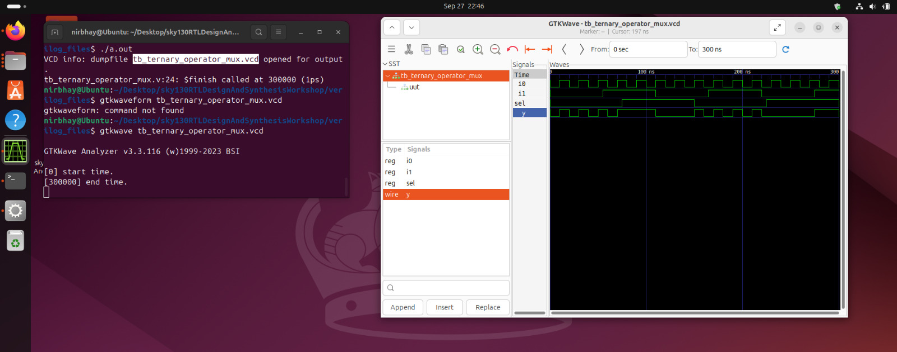
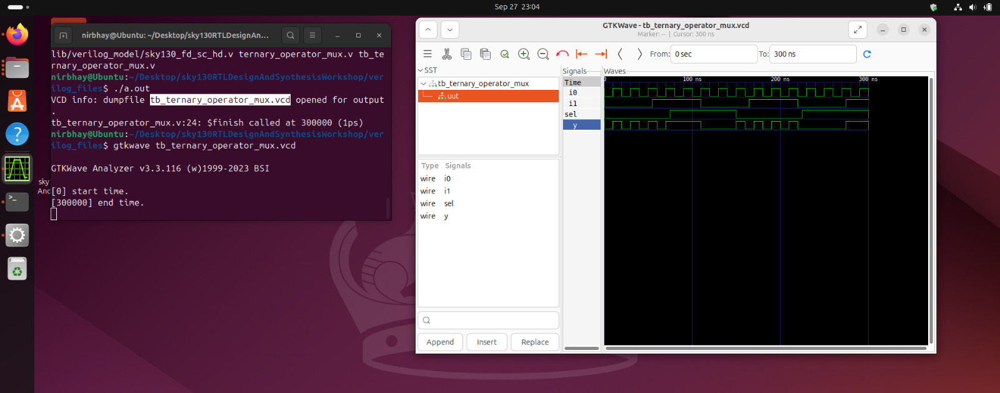
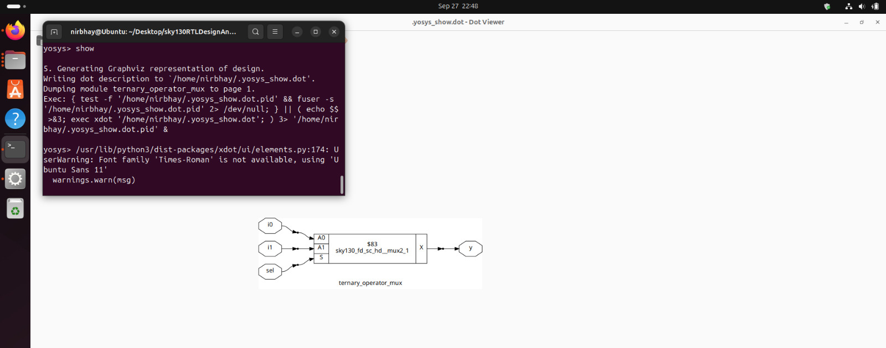
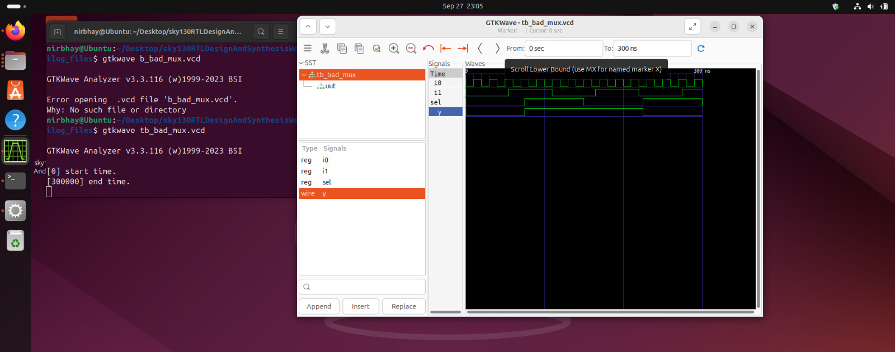
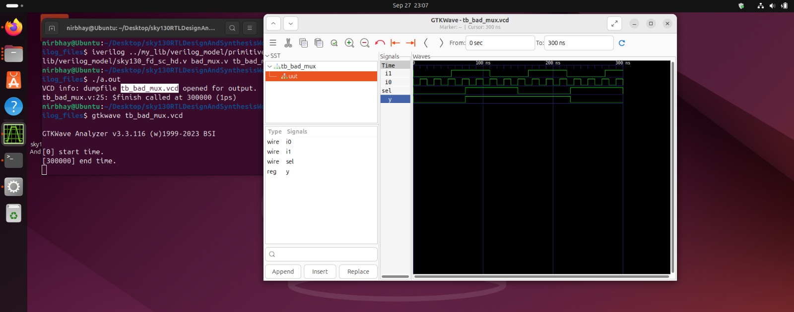
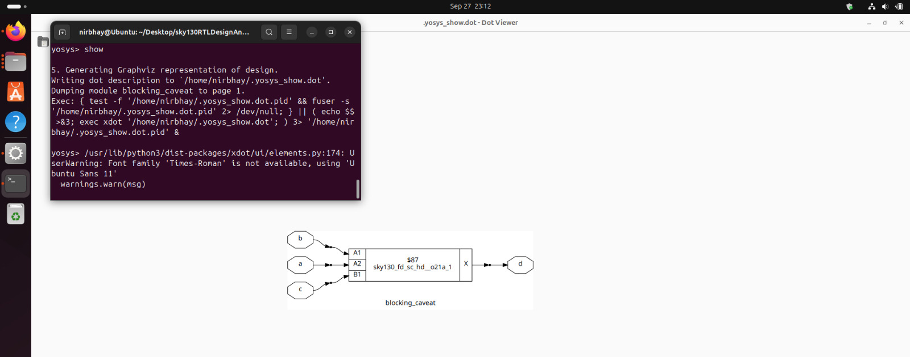

## 📅 Week 1 — Day 4: Gate-Level Simulation (GLS) and Synthesis Verification  

Gate-Level Simulation (GLS) is an important step after synthesis to **verify the logical correctness** and **timing of a design**.  

---

### ⚡ 1️⃣ Introduction to GLS  

- **GLS** runs the **testbench (TB)** on the **netlist** generated after synthesis.  
- The netlist is **logically equivalent** to the RTL code.  
- Since the netlist represents the same functionality, the **same testbench used for RTL can be reused**.  

#### Why run GLS?  
- To **verify logical correctness** of the synthesized design.  
- To ensure that **timing constraints are met**.  
- **GLS requires delay annotation** if timing-aware gate models are used.  

---

### 🖥️ Running GLS using Iverilog  

```bash
iverilog ../my_lib/verilog_model/primitives.v ../my_lib/verilog_model/sky130_fd_sc_hd.v ternary_operator_mux.v tb_ternary_operator_mux.v
```
### ⚡ 2️⃣ Synthesis Simulation Mismatch  

Common reasons for mismatch between RTL simulation and netlist simulation:  

- Missing **sensitivity list** in `always` blocks.  
- **Blocking vs Non-blocking assignments** incorrectly used.  
- Non-standard or unsupported Verilog coding practices.  

> Simulators work on **signal activity**: output only changes if there is a change in input.  

---

### ⚡ 3️⃣ Blocking vs Non-Blocking Statements  

Inside an `always` block:  

- **Blocking (`=`)**  
  - Executes **sequentially in the order written**.  
  - Each statement completes before the next begins.  

- **Non-blocking (`<=`)**  
  - RHS values are **evaluated when the block is entered**, LHS is assigned at the end.  
  - **Order does not matter** within the always block.  
  - Preferred for **sequential logic** (flip-flops, registers) to avoid race conditions.  

```verilog
always @(posedge clk) begin
    a = b;     // Blocking
    c <= d;    // Non-blocking
end
```

### 🧪 Gate-Level Simulation (GLS) Lab 

Below are the practical labs for Week 1 — Day 4 to reinforce GLS and synthesis verification concepts.  

---

#### **Lab 1:**
  
```verilog
module ternary_operator_mux (input i0 , input i1 , input sel , output y);
	assign y = sel?i1:i0;
	endmodule
```




#### **Lab 2:**
  
```verilog
module bad_mux (input i0 , input i1 , input sel , output reg y);
always @ (sel)
begin
	if(sel)
		y <= i1;
	else 
		y <= i0;
end
endmodule
```




#### **Lab 3:**
  
```verilog
module blocking_caveat (input a , input b , input  c, output reg d); 
reg x;
always @ (*)
begin
	d = x & c;
	x = a | b;
end
endmodule
```



---

### 📌 Key Takeaways

- GLS ensures that the **synthesized netlist behaves like RTL**.  
- Proper usage of **blocking/non-blocking statements** is critical to avoid simulation mismatches.  
- Timing-aware gate models allow **GLS to validate timing**, not just logic.  
