# 📅 Week 1 — Day 5: Optimization in Synthesis

On Day 5, we focused on **writing optimized and synthesizable Verilog**. The key topics covered included proper usage of `if-else` statements, `case` statements, loops, and generate blocks. These constructs help implement combinational and sequential logic efficiently while avoiding common synthesis issues such as **inferred latches**.

---

## Key Concepts

### 1. If-Else and Case Statements
- If-else and case statements are commonly used for conditional logic in RTL design.
- **Incomplete assignments** can lead to inferred latches, which may unintentionally store values between cycles.
- Always ensure that **all output signals are assigned in every execution path**.
- Using `default` cases or `else` blocks prevents unintentional latches.

### 2. For Loops
- For loops are used in procedural blocks to **repeat logic efficiently**.
- Synthesizable loops must have a **fixed iteration count at compile time**.
- Useful for implementing structures like **MUXes, adders, and registers arrays**.

### 3. Generate Blocks
- Generate blocks allow **compile-time instantiation** of multiple modules or repeated logic.
- Often used with `genvar` and for-loops to create **scalable hardware designs** like multi-bit adders or demuxes.
- Helps reduce manual coding errors and improves readability.

### 4. Ripple Carry Adder (RCA)
- An RCA is built by chaining full adders.
- Each carry-out is connected to the next stage’s carry-in.
- Generate blocks simplify the creation of multi-bit adders without writing repetitive code manually.

### 5. Common Synthesis Optimizations
- **Constant propagation:** Eliminates redundant logic when a signal is constant.
- **Boolean logic optimization:** Reduces logic complexity using simplification algorithms.
- **State optimization and retiming:** Improves timing by rearranging sequential and combinational elements.
- **Unused output removal:** Reduces area and power by removing logic for unconnected outputs.

---
## Lab
This section contains the practical labs for Day 5, focusing on **if-else statements, case statements, for loops, and generate blocks**. These labs demonstrate how improper coding can lead to inferred latches and how to write optimized, synthesizable Verilog.

---

### Lab 1:
```verilog
module incomp_if (input i0 , input i1 , input i2 , output reg y);
always @ (*)
begin
	if(i0)
		y <= i1;
end
endmodule
```
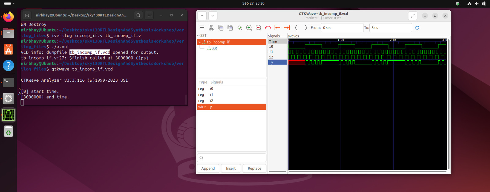
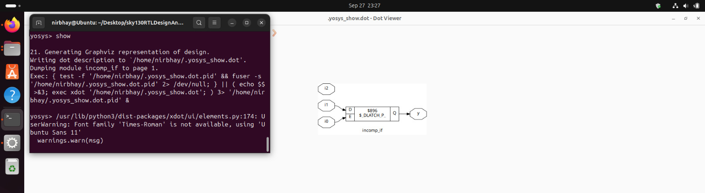

### Lab 2: 
```verilog
module incomp_if2 (input i0 , input i1 , input i2 , input i3, output reg y);
always @ (*)
begin
	if(i0)
		y <= i1;
	else if (i2)
		y <= i3;
end
endmodule
```
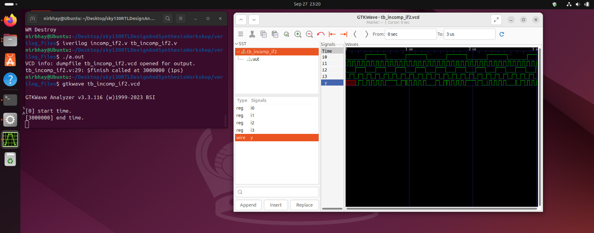
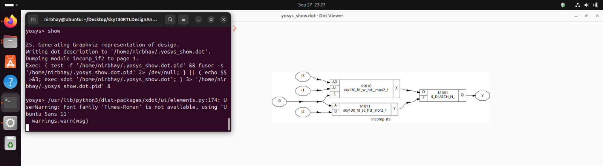

### Lab 3:
```verilog
module bad_case (input i0 , input i1, input i2, input i3 , input [1:0] sel, output reg y);
always @(*)
begin
	case(sel)
		2'b00: y = i0;
		2'b01: y = i1;
		2'b10: y = i2;
		2'b1?: y = i3;
		//2'b11: y = i3;
	endcase
end
endmodule
```
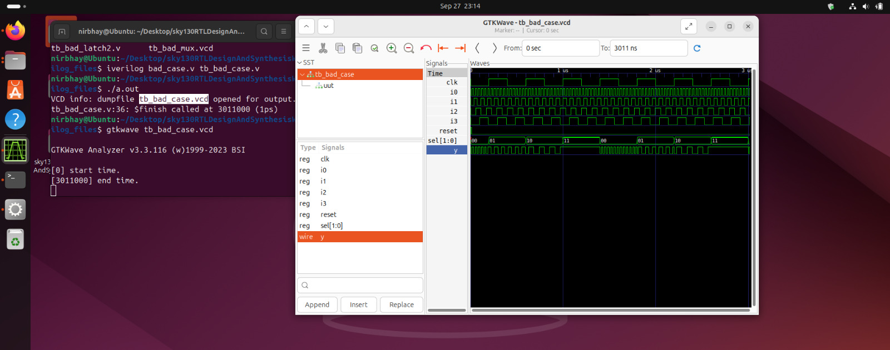
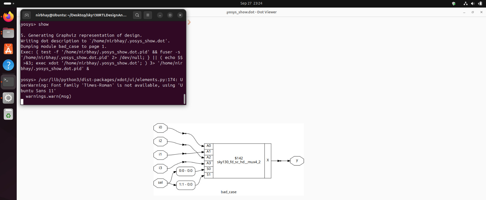

### Lab 4:
```verilog
module comp_case (input i0 , input i1 , input i2 , input [1:0] sel, output reg y);
always @ (*)
begin
	case(sel)
		2'b00 : y = i0;
		2'b01 : y = i1;
		default : y = i2;
	endcase
end
endmodule
```
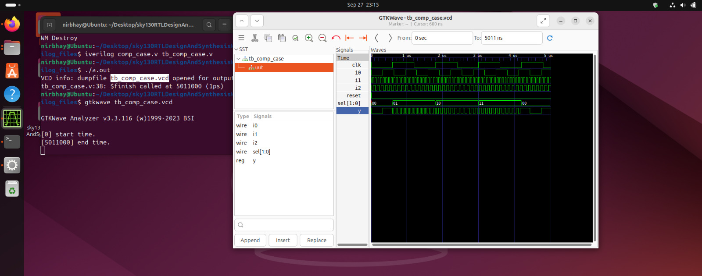
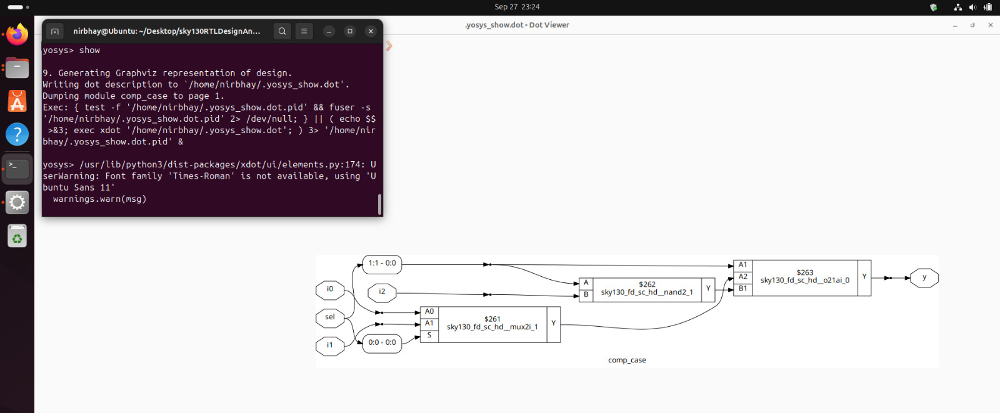

### Lab 5:
```verilog
module demux_case (output o0 , output o1, output o2 , output o3, output o4, output o5, output o6 , output o7 , input [2:0] sel  , input i);
reg [7:0]y_int;
assign {o7,o6,o5,o4,o3,o2,o1,o0} = y_int;
integer k;
always @ (*)
begin
y_int = 8'b0;
	case(sel)
		3'b000 : y_int[0] = i;
		3'b001 : y_int[1] = i;
		3'b010 : y_int[2] = i;
		3'b011 : y_int[3] = i;
		3'b100 : y_int[4] = i;
		3'b101 : y_int[5] = i;
		3'b110 : y_int[6] = i;
		3'b111 : y_int[7] = i;
	endcase
end
endmodule
```
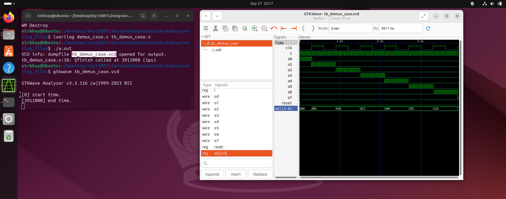
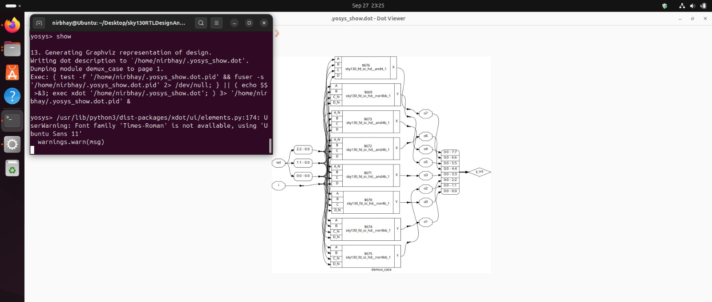

### Lab 6:
```verilog
module demux_generate (output o0 , output o1, output o2 , output o3, output o4, output o5, output o6 , output o7 , input [2:0] sel  , input i);
reg [7:0]y_int;
assign {o7,o6,o5,o4,o3,o2,o1,o0} = y_int;
integer k;
always @ (*)
begin
y_int = 8'b0;
for(k = 0; k < 8; k++) begin
	if(k == sel)
		y_int[k] = i;
end
end
endmodule
```
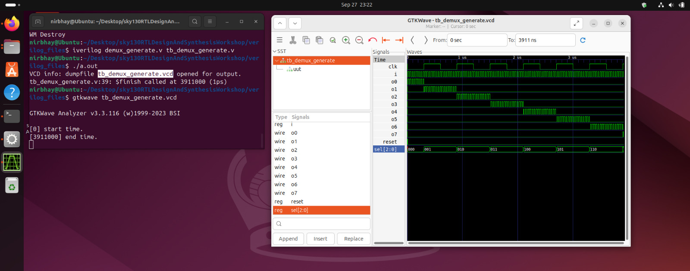
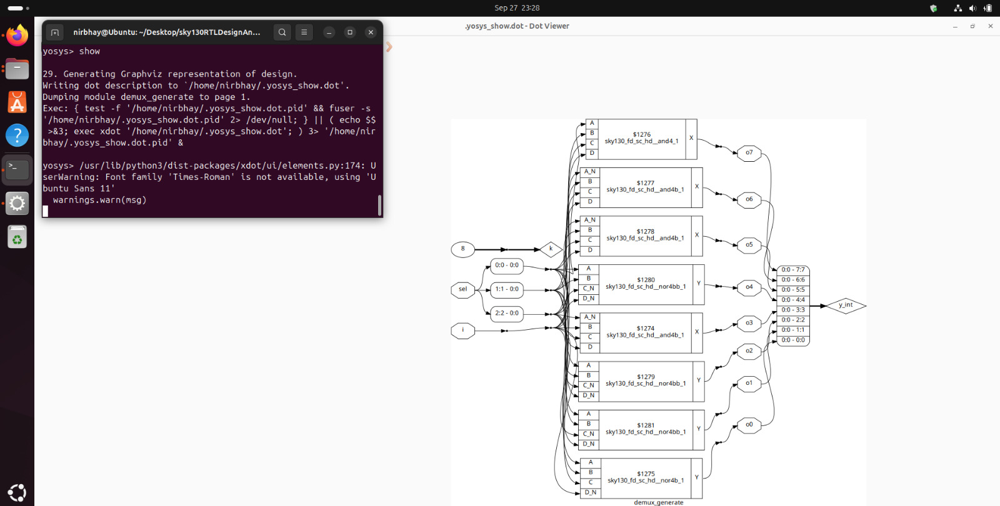

### Lab 7:
```verilog
module incomp_case (input i0 , input i1 , input i2 , input [1:0] sel, output reg y);
always @ (*)
begin
	case(sel)
		2'b00 : y = i0;
		2'b01 : y = i1;
	endcase
end
endmodule
```
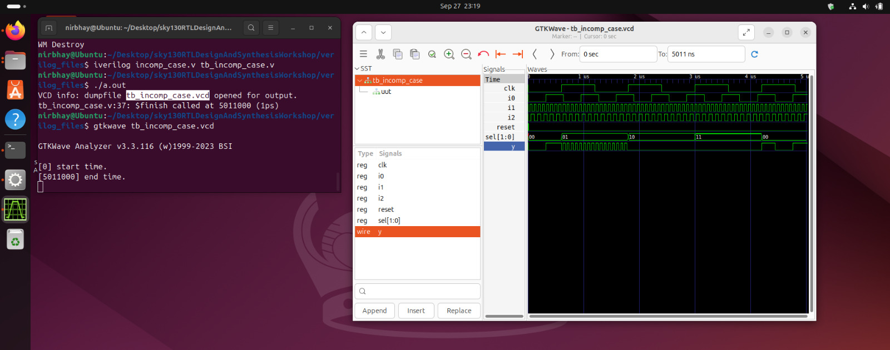
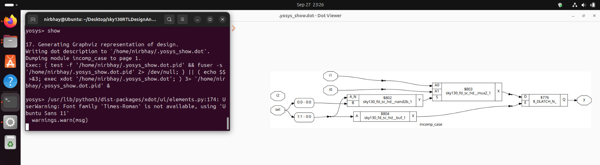

### Lab 8:
```verilog
module mux_generate (input i0 , input i1, input i2 , input i3 , input [1:0] sel  , output reg y);
wire [3:0] i_int;
assign i_int = {i3,i2,i1,i0};
integer k;
always @ (*)
begin
for(k = 0; k < 4; k=k+1) begin
	if(k == sel)
		y = i_int[k];
end
end
endmodule
```
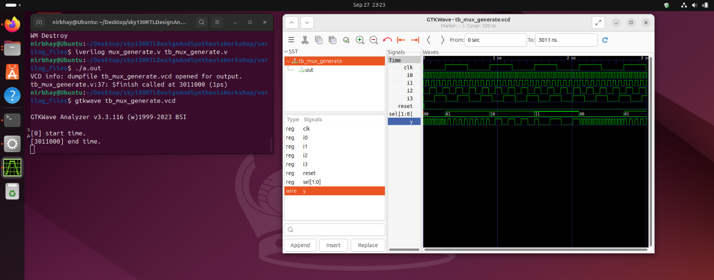
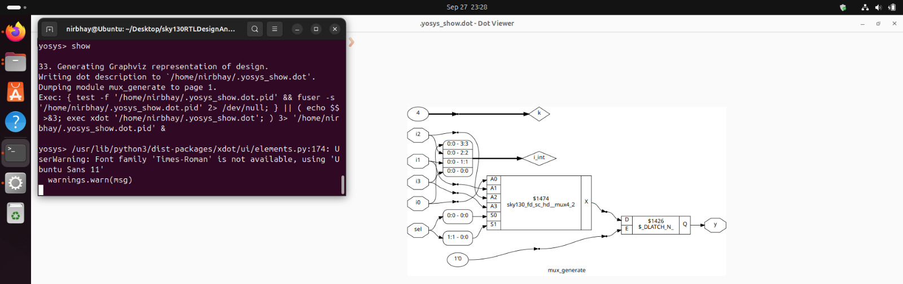

### Lab 9:
```verilog
module partial_case_assign (input i0 , input i1 , input i2 , input [1:0] sel, output reg y , output reg x);
always @ (*)
begin
	case(sel)
		2'b00 : begin
			y = i0;
			x = i2;
			end
		2'b01 : y = i1;
		default : begin
		           x = i1;
			   y = i2;
			  end
	endcase
end
endmodule
```
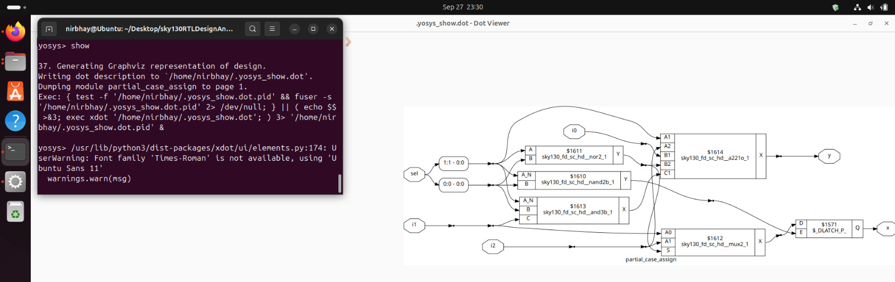

### Lab 10:
```verilog
module rca (input [7:0] num1 , input [7:0] num2 , output [8:0] sum);
wire [7:0] int_sum;
wire [7:0]int_co;

genvar i;
generate
	for (i = 1 ; i < 8; i=i+1) begin
		fa u_fa_1 (.a(num1[i]),.b(num2[i]),.c(int_co[i-1]),.co(int_co[i]),.sum(int_sum[i]));
	end

endgenerate
fa u_fa_0 (.a(num1[0]),.b(num2[0]),.c(1'b0),.co(int_co[0]),.sum(int_sum[0]));

assign sum[7:0] = int_sum;
assign sum[8] = int_co[7];
endmodule
// Full Adder module
module fa (input a , input b , input c, output co , output sum);
	assign {co,sum}  = a + b + c ;
endmodule
```
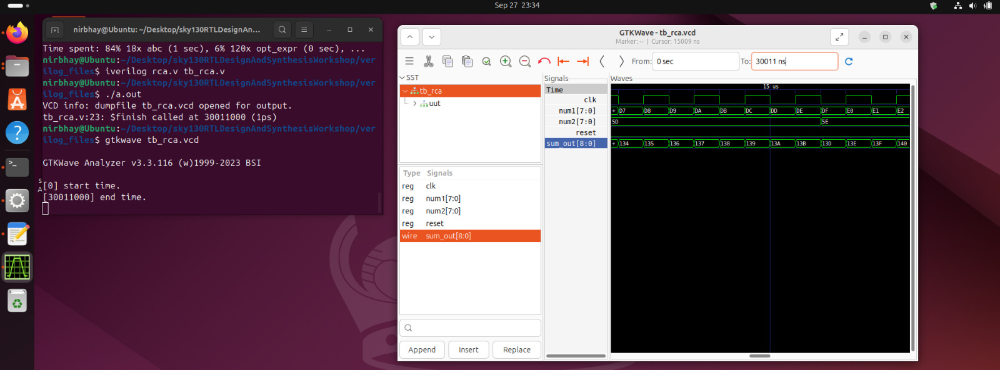
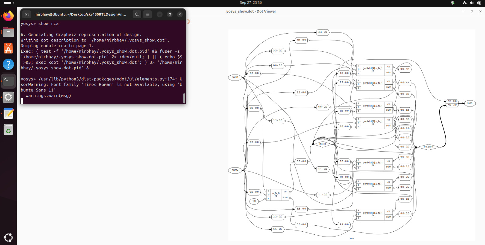

---
### Takeaways
- Always write **complete conditional statements** to avoid inferred latches.
- Loops and generate blocks help make designs **modular, scalable, and synthesizable**.
- Optimizations in synthesis reduce area, power, and timing overheads while ensuring logical correctness.

