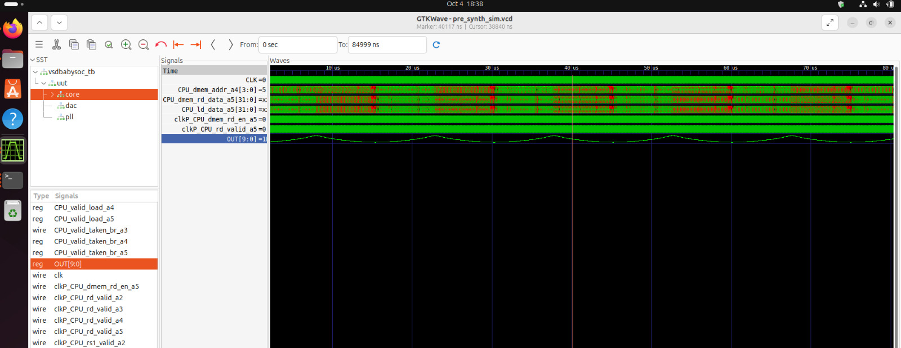
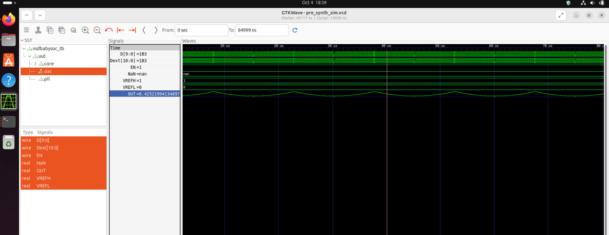
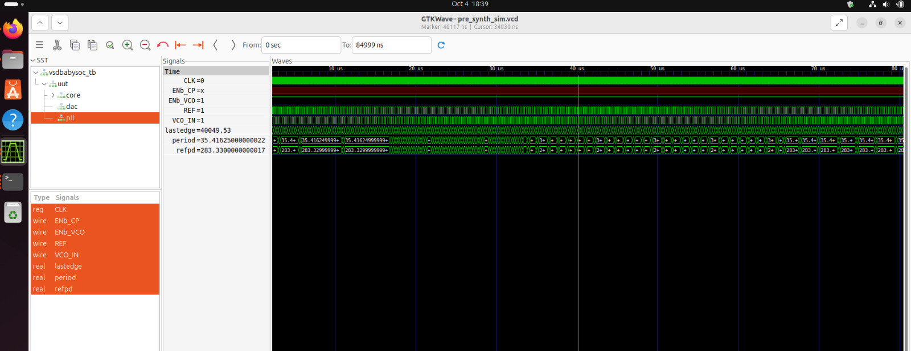

# Week 2 – BabySoC Fundamentals & Functional Modelling  

## Introduction  
The semiconductor industry has been steadily moving towards higher integration, performance, and efficiency. A **System-on-Chip (SoC)** is one of the key milestones in this evolution, bringing together multiple components of a computing system into a single integrated circuit (IC).  

Instead of relying on several discrete chips connected via a PCB, SoCs integrate the CPU, memory, peripherals, and interconnects in one place. This reduces the cost, size, and power requirements while improving overall performance. From smartphones to IoT devices and even advanced computing platforms, SoCs are now the backbone of modern digital systems.  

In this write-up, I will summarize the fundamentals of SoC design, explain its major building blocks, highlight the educational importance of the **BabySoC** model, and discuss the critical role of **functional modelling** in the SoC design flow.  

---

## What is a System-on-Chip (SoC)?  
A **System-on-Chip** is an IC that integrates all the essential modules of a computer system into one chip.  

**Key advantages of SoCs include:**  
- **Compactness**: Saves board space by replacing multiple discrete ICs.  
- **Performance**: On-chip data transfer is faster than PCB interconnects.  
- **Power efficiency**: Optimized integration consumes less energy.  
- **Cost-effectiveness**: Fewer components reduce manufacturing and packaging costs.  
- **Scalability**: Same base architecture can be scaled for different applications.  

SoCs are especially important in **resource-constrained environments** like mobile phones and embedded devices where every milliwatt and millimeter counts.  

---

## Components of a Typical SoC  

### 1. CPU (Central Processing Unit)  
- Acts as the "brain" of the SoC.  
- Responsible for instruction execution, decision making, and system control.  
- May be a general-purpose processor (ARM, RISC-V) or an application-specific processor (DSP, custom accelerator).  

### 2. Memory  
- **Volatile memory (SRAM, DRAM):** Temporary data and program storage.  
- **Non-volatile memory (Flash, ROM):** Permanent storage for firmware and configurations.  
- Provides both **instruction memory** (for program code) and **data memory** (for working storage).  

### 3. Peripherals  
- Enable the SoC to interact with the outside world.  
- Examples:  
  - **GPIO (General Purpose Input/Output)**  
  - **Communication protocols:** UART, I2C, SPI  
  - **Timers and Counters**  
  - **Interrupt Controllers**  
- These peripherals make the SoC versatile and suitable for diverse applications.  

### 4. Interconnect (Bus/Fabric)  
- Provides the communication backbone between CPU, memory, and peripherals.  
- Must support high bandwidth and low latency.  
- Common bus standards: **AMBA (AXI, AHB, APB)**.  
- Acts like the “nervous system” of the chip.  

---

## Why BabySoC?  
The **BabySoC** is a simplified, educational model designed to help students and beginners learn SoC design without being overwhelmed by real-world complexity.  

**Key features of BabySoC:**  
- A minimal **CPU core** with basic instruction execution.  
- Small, easy-to-understand **memory modules**.  
- A **reduced set of peripherals**, only the essentials.  
- A **lightweight interconnect** that avoids complicated protocols.  

By reducing the complexity, BabySoC allows learners to:  
- Focus on **core SoC concepts** rather than implementation overhead.  
- Understand how each block communicates.  
- Trace signals using simulation and visualization tools.  
- Gain confidence before tackling full-scale RTL and physical design challenges.  

Thus, BabySoC acts as the **stepping stone** for a deeper journey into VLSI and SoC design.  

---

## Role of Functional Modelling in SoC Design  
The SoC design flow typically progresses through several stages:  

1. **Specification** – Defining what the SoC should do.  
2. **Functional Modelling** – Abstract-level representation and verification.  
3. **RTL Design** – Writing Verilog/VHDL for cycle-accurate design.  
4. **Synthesis and Physical Design** – Converting RTL to gate-level netlists and layouts.  
5. **Fabrication & Testing** – Manufacturing and post-silicon validation.  

### Why Functional Modelling Matters:  
- **Early validation**: Helps test whether the architecture works as intended before investing time in RTL.  
- **Exploration**: Designers can evaluate memory sizes, bus widths, and instruction flows.  
- **Debugging**: Issues are easier to identify at this abstraction level.  
- **Time & cost savings**: Prevents late-stage design rework.  

**Tools commonly used:**  
- **Icarus Verilog** – Open-source Verilog simulation tool.  
- **GTKWave** – Waveform viewer to visualize signal activity over time.  

These tools allow students to observe CPU–memory interactions, verify control signals, and confirm that the BabySoC behaves as expected at the functional level.  

---

## 🛠 Getting Started

📥 Clone the Project
```bash
cd ~/VLSI
git clone https://github.com/manili/VSDBabySoC.git
cd VSDBabySoC
```

🔄 Convert TLV to Verilog
RVMYTH uses TL-Verilog (.tlv) and needs conversion to Verilog.
Steps:

# Install tools
```bash
sudo apt update
sudo apt install python3-venv python3-pip

# Set up virtual environment
python3 -m venv sp_env
source sp_env/bin/activate

# Install SandPiper-SaaS
pip install pyyaml click sandpiper-saas
# Convert TLV to Verilog
sandpiper-saas -i ./src/module/*.tlv -o rvmyth.v --bestsv --noline -p verilog --outdir ./src/module/
```
Output: rvmyth.v in src/module/.

---

### 🧪 Running Simulation

#### 🔹 Pre-Synthesis Simulation
```bash
mkdir -p output/pre_synth_sim

iverilog -o output/pre_synth_sim/pre_synth_sim.out \
  -DPRE_SYNTH_SIM \
  -I src/include -I src/module \
  src/module/testbench.v

cd output/pre_synth_sim
./pre_synth_sim.out
```

#### 📊 View Waveforms
Run:
```bash
gtkwave output/pre_synth_sim/pre_synth_sim.vcd
```

#### Output Waveform




### 🧠 How the CPU Works

- The CPU runs a fixed program to:
  - Count numbers.
  - Store results in r17.
  - Create waveforms for DAC.
  - Loop indefinitely.

#### Instructions
  - ADDI r9, r0, 1: Sets r9 = 1 (step size).
  - ADDI r10, r0, 43: Sets r10 = 43 (loop limit).
  - ADDI r11, r0, 0: Sets r11 = 0 (counter).
  - ADDI r17, r0, 0: Sets r17 = 0 (DAC input).
  - ADD r17, r17, r11: Adds r11 to r17.
  - ADDI r11, r11, 1: Increments r11.
  - BNE r11, r10, -4: Loops until r11 = 43.
  - ADD r17, r17, r11: Adds r11 to r17.
  - SUB r17, r17, r11: Subtracts r11 from r17.
  - SUB r11, r11, r9: Decrements r11 by r9.
  - BNE r11, r9, -4: Loops until r11 = 1.
  - SUB r17, r17, r11: Adjusts r17.
  - BEQ r0, r0, ...: Stays in loop.

#### Program Phases
  - Ramp Up: r11 = 0 to 42, r17 sums to 903, steady increase.
  - Peak: r11 = 43, r17 = 946, maximum value.
  - Oscillation: r11 = 43 to 1, r17 = 903 ± r11, up-and-down pattern.
  - Final: r11 = 1, r17 adjusted, holds steady.
  - Flow: Instructions → CPU → r17 → DAC → Analog Output.

### 📈 DAC Output

Converts r17 to voltage using:

#### Scaling:
$$
V_{OUT} = \frac{r_{17}}{1023} \times V_{REF\_SPAN} \quad (\text{with } V_{REF\_SPAN} = 1.0\ \text{V})
$$

Example voltages:
- r17 = 903, Vout = 0.882 V.
- r17 = 946, Vout = 0.925 V.

In GTKWave, set OUT to Analog Step for visualization.

---

## Conclusion  
Modern electronic devices rely heavily on SoCs because of their compactness, performance, and efficiency. Understanding their architecture and design flow is essential for anyone entering the semiconductor and VLSI domains.  

The **BabySoC** model provides a beginner-friendly platform to learn these concepts. It abstracts the overwhelming complexity of industrial SoCs into a minimal, manageable design while still teaching the **fundamentals of CPU, memory, interconnect, and peripherals**.  

Through **functional modelling** with simulation tools like Icarus Verilog and GTKWave, students gain early exposure to the design process, validate their understanding, and prepare themselves for advanced stages such as RTL design and physical implementation.  

In summary, BabySoC bridges the gap between theory and practice, laying the foundation for becoming proficient in **SoC design and VLSI engineering**.  

---
